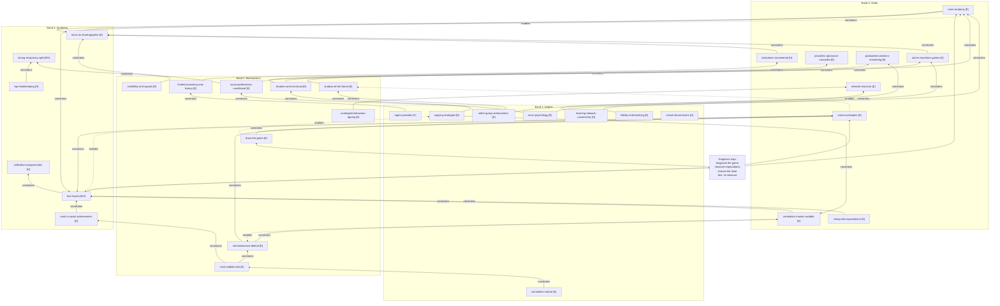

# The unified model: Origins, Mechanisms, Order, Synthesis, and the loop that connects them

This page compresses eleven books into 32 nodes in four bands, the links between them, a causal
chain, twelve laws of cooperation, and one loop the learner runs on their own group. Read it like a
building: cultural evolution is the foundation, each band constrains the one above, and certainty
drops as you go up. The formal results in Mechanisms are theorems; the institutional prescriptions
in Order are mostly hypothesis and value; Synthesis is one author's attempt to unify the rest, held
under critique.

Tags follow the SPEC: **[E]** supported by evidence, **[H]** hypothesis to test in your group,
**[V]** value commitment. Tags follow the book files' evidence sections and the claims ledger; where
the ledger splits a claim, the node carries the split. Book files are the authority for any
single-source claim; this page is the authority for how claims fit together. Numbers come only from
the ledger's section 4; background figures are marked approximate.

The spine is ledger rule 1 (X5): the four accounts of how a group settles on a way of behaving are
**layers, not rivals**. Nash and ESS test whether a pattern is stable. Skyrms and Camerer predict
which stable pattern a group drifts to absent intervention. Gintis names what a norm does: a public
signal that aligns conjectures. Bicchieri specifies what must be true inside people for the signal
to work, and how to measure it. Everything else hangs off that ordering.

---

## 1. The core causal chain in plain words

Each sentence is licensed by the node in brackets; the chain reads bottom-up.

1. **Humans are cultural learners.** A person's competence and sense of what is normal come from
   selectively copying others, not from working things out alone. [`cumulative-culture`]
2. **Copying runs on rules, not arguments.** People copy the successful, the prestigious, the
   majority and the similar, especially when uncertain; the rules pay because what is displayed has
   already been filtered by the displayer's incentives. Persuasion is the weak channel.
   [`copying-strategies`]
3. **Copying carries norms, and humans are built to hold them.** We learn what others expect, feel
   shame at violation, and sanction violators; the psychology is content-neutral and enforces
   whatever rules it finds. [`norm-psychology`]
4. **Therefore what a group does is a stable pattern before it is anyone's choice.** Once enough
   people follow a rule, following it is each person's best reply; stability is the only thing
   equilibrium certifies, several patterns can coexist, and history picks one.
   [`nash-stability-test`, `contingent-behaviour-tipping`]
5. **Which pattern a group drifts to is predictable, and it is usually the safe one.** Under random
   mixing, best-response learning, large numbers and no communication, the risk-dominant outcome
   wins because its basin is larger, not because it is better. [`risk-dominance-default`]
6. **Most cooperation problems are trust problems, not temptation problems.** Ask whether a member
   gains by defecting when everyone else cooperates: no means stag hunt (assurance); yes means
   dilemma (payoff change, repetition or sanctions). Diagnose before prescribing.
   [`draw-the-game`, `shadow-of-the-future`]
7. **Fairness and generosity are real but conditional.** People pay to punish unfair intentions,
   give when observed, and cooperate if they expect others to; most of this is cued norm compliance,
   so it moves with framing, anonymity and expectations. [`social-preferences-conditional`,
   `situation-and-construal`]
8. **Therefore a norm is a fact about expectations.** A social norm exists when people prefer to
   follow a rule on condition that they believe others follow it and believe others expect them to;
   remove either belief and the behaviour goes. [`norm-anatomy`]
9. **A live norm changes the game.** While both expectations hold, a dilemma becomes a coordination
   game; the cheapest way to create the expectations is relevant talk, which roughly doubles lab
   cooperation but decays without repetition or sanctions where defection dominates.
   [`norms-transform-games`, `cheap-talk-expectations`]
10. **Whether the good pattern spreads depends on who meets whom and who copies whom.** Any departure
    from random matching that makes cooperators meet cooperators enlarges the good basin, but only
    under success-copying; dense clusters block a norm entering and protect one adopted inside;
    costly behaviour needs several adopting neighbours. [`correlation-master-variable`,
    `network-structure`]
11. **None of this holds by itself, so durable groups build institutions.** Commons that last have
    clear boundaries, rules fitted to conditions, participation in rule-making, cheap by-product
    monitoring, graduated sanctions, cheap conflict resolution and outside recognition; a checklist,
    not a recipe. [`ostrom-principles`, `graduated-sanctions-monitoring`]
12. **Institutions are copied, then crafted incrementally by the people they bind.** Start from a
    visibly successful peer's norm package and revise in small steps with the members; rules are as
    strong as the arena for changing them. [`institutions-incremental`]
13. **A working institution is a choreographer.** It is a public signal that tells each person what
    to do and expect, so the cooperative pattern is a correlated equilibrium nobody wants to leave;
    that alignment is a social achievement, not a deduction from rationality.
    [`nash-is-social-achievement`, `norm-as-choreographer`]
14. **A designed institution sustains cooperation in a real group when all four layers hold at
    once:** the target pattern is stable (layer 1), the group's matching and learning regime lets it
    be reached (layer 2), a clear public signal names it (layer 3), and members' measured empirical
    and normative expectations point at it (layer 4). The learner checks each layer, in order, and
    keeps checking. [`four-layers`]

---

## 2. The nodes

Every node is a claim, not a topic. Format: **id** · label · tag · summary · links.

### Band 1: Origins (why humans are cultural, social learners; where cooperation comes from)

Sources: `01-secret-of-our-success`, `02-darwins-unfinished-symphony`.

**`cumulative-culture`** · Competence lives in inherited practice, not in individuals · **[E]**
Know-how ratchets across generations because each learner starts from the best available model;
no individual could derive it, and explorers cut off from it died (Henrich). Young children match
chimpanzees on physical cognition and are far ahead on social learning (Herrmann et al. 2007,
background). A group's competence is in its practices and learning network, and turnover can lose it
silently.
Links: `copying-strategies`, `fidelity-and-teaching`, `learning-network-connectivity`.

**`copying-strategies`** · People copy by rules, and the rules are the levers · **[E]**
Whom and what people copy follows strategies: copy the successful, the prestigious, the majority
when uncertain, the similar; discount stale information (Henrich's biases and Laland's strategies
are the same objects, ledger X1). Copying pays because demonstrators pre-filter: what you see is what
others chose to display (Rendell et al. 2010, verified; a simulation, not people). Change what is
visibly successful and who is visibly prestigious; explanation is the weak channel for norm
adherence.
Links: `cumulative-culture`, `rogers-paradox`, `correlation-master-variable`, `network-structure`,
`situation-and-construal`.

**`rogers-paradox`** · Populations of pure copiers stagnate; someone must be paid to innovate · **[H]**
Copiers out-compete innovators individually, yet populations that copy too much sit on a stale
knowledge pool and do worse on average (Laland). A model result, so a hypothesis for any group, but
the symptom is familiar: "best practice" that circulates faster than anyone tests it. Pair every
copy-the-successful lever with a protected budget for trying things.
Links: `copying-strategies`, `learning-network-connectivity`, `limited-reasoning-and-history`.

**`learning-network-connectivity`** · Skill retention and innovation track the connectivity of the
learning network · **[H]**
Both Origins books argue that larger, better-connected learning populations retain and innovate
more, and isolation loses skills. Lab transmission chains support the mechanism at small scale; the
archaeological case (Tasmania) is contested (Vaesen et al. 2016) and the variable is reframed from
head-count to effective connectivity (ledger rule 6). Silos shrink the learning network; how much
that costs is a hypothesis.
Links: `cumulative-culture`, `network-structure`, `rogers-paradox`.

**`fidelity-and-teaching`** · Fidelity is the bottleneck for accumulation; hidden-structure skills
need teaching, norms do not · **[E]**
Below a threshold of transmission accuracy, skills are lost as fast as gained; teaching and language
are fidelity technologies (Laland). In the one stone-tool experiment (Morgan et al. 2015, verified,
N = 184), imitation added little over reverse engineering while teaching and language gained most.
Henrich's over-imitation shows the reverse for practices with hidden payoffs: people copy without
understanding and explanation does not produce adherence. Teach skills; model norms (rule 8).
Links: `cumulative-culture`, `copying-strategies`, `norm-psychology`.

**`norm-psychology`** · Humans carry a content-neutral norm psychology: learn rules, expect them of
others, feel shame, sanction violators · **[E]**
Henrich's self-domestication and Gintis's normative predisposition agree that humans acquire and
enforce rules, including as third parties; the disposition is universal, the content is not
(small-scale-society ultimatum offers ran from about 26% to about 58%, Henrich et al. 2001,
verified). How deeply norms are internalized is open (X9): assume a norm is conditional until it
survives a collapse of expectations. Reputation and ostracism often move people more than fines, and
people enforce rules you did not intend.
Links: `norm-anatomy`, `social-preferences-conditional`, `strong-reciprocity-split`,
`within-group-enforcement`.

**`within-group-enforcement`** · Reciprocity, reputation and sanction are the evidenced engines of
cooperative norms; cultural group selection is the hypothesis · **[E]**
Within-group mechanisms are [E] across all three lower bands. Cultural group selection (groups with
cooperative norm packages out-competing and being imitated by others) is defended by Henrich and
Gintis, doubted by Laland, and argued in a 2016 target article with many critical commentaries (X2,
C2). Rule 5: CGS is [H] and never the sole basis of a design claim. Copy a peer's norm package as a
starting point; justify the design by within-group mechanisms.
Links: `norm-psychology`, `shadow-of-the-future`, `graduated-sanctions-monitoring`,
`institutions-incremental`.

**`culture-drove-brains`** · Reliance on culture selected for the capacities that make culture
richer · **[H]**
The shared Origins hypothesis (Henrich's cultural brain, Laland's cultural drive): brains, long lives
and sociality are consequences of reliance on social learning. Support is correlational (Street et
al. 2017, verified); diet and social-brain accounts remain live (X3, C7). It grounds the claim that
cultural learning is fast and automatic; it licenses no design decision on its own.
Links: `cumulative-culture`, `norm-psychology`.

### Band 2: Mechanisms (the psychology of individuals in groups and the formal language of strategic interaction, and where behaviour departs from it)

Sources: `03-social-psychology`, `04-games-of-strategy`, `05-micromotives-and-macrobehavior`,
`06-behavioral-game-theory`.

**`draw-the-game`** · Write down players, strategies, payoffs, order and information before arguing
about the outcome, then classify · **[E]**
Most disputes about why people will not cooperate dissolve once the matrix is drawn (Dixit et al.).
The one agreed diagnostic (rule 13): does a member gain by defecting when everyone else cooperates?
Yes means prisoner's dilemma (payoffs, repetition, sanctions); no means stag hunt (assurance).
Chicken and battle-of-the-sexes need turn-taking or tie-breaks. Schelling's binary-choice diagram is
the population version of the test. Skyrms's "the social contract is a stag hunt" is interpretive;
Ostrom's open-access cases are real dilemmas.
Links: `nash-stability-test`, `risk-dominance-default`, `shadow-of-the-future`,
`contingent-behaviour-tipping`, `norms-transform-games`, `ostrom-principles`.

**`nash-stability-test`** · Nash and ESS certify stability, not prediction and not goodness · **[E]**
A Nash equilibrium is a profile from which no one gains by deviating alone; mutual defection is one
because it is stable, not because anyone wants it (rule 14). With several equilibria the concept
predicts nothing; history and salience pick. ESS is the population form, so which of several stable
norms a group holds depends on where it started. Never use "equilibrium" as approval (C32); never
contrast "rational" with "fair" (rule 16).
Links: `draw-the-game`, `risk-dominance-default`, `contingent-behaviour-tipping`,
`nash-is-social-achievement`, `four-layers`.

**`risk-dominance-default`** · Absent intervention, groups drift to the risk-dominant outcome, not
the best one · **[E]**
The payoff-dominant equilibrium is best for all if reached; the risk-dominant one is the best reply
against a 50/50 opponent and has the larger basin. Under random mixing, best-response updating, large
groups and no communication it wins in the models and in the lab: weak-link groups of 14 to 16 fell
to the minimum effort while fixed pairs reached the top (Van Huyck et al. 1990, group-size result
verified). Coordination failure is strategic uncertainty plus history, not a payoff problem (C37);
"sweeten the joint payoff" is the weakest lever. Group size and the aggregation rule are design
variables, and selection devices (two-way talk, leader communication, focal labels, gradual growth
from a small core; Weber 2006, verified, single lab) beat payoff sweeteners.
Links: `nash-stability-test`, `correlation-master-variable`, `cheap-talk-expectations`,
`limited-reasoning-and-history`, `ostrom-principles`, `four-layers`.

**`shadow-of-the-future`** · Repetition permits cooperation as one equilibrium among many; selection
and fast detection are separate problems · **[E]**
Cooperation survives in a repeated dilemma only when the future is long, uncertain and observable;
announced endpoints unravel it and noise demands forgiveness. The folk theorem is an existence result
(C27): the group must still coordinate on the cooperative equilibrium and detect defection fast.
Recommend "nice, retaliatory, forgiving, clear", never tit-for-tat (rule 15). Ostrom's field
variable for the discount factor is turnover: make users transient and the commons breaks.
Links: `draw-the-game`, `credibility-and-signals`, `within-group-enforcement`,
`graduated-sanctions-monitoring`, `institutions-incremental`.

**`credibility-and-signals`** · Threats and promises work only when executing them is in your
interest at the time; costly signals reveal type · **[E]**
Credibility is manufactured by limiting oneself: commitment devices, delegation, reputation, small
steps (Dixit et al.); a sanction that would not actually be applied is not a sanction. Asymmetric
information is solved by signals cheaper for the good type and menus that make each type reveal
itself; Henrich's credibility-enhancing displays are the cultural version. A leader who says "quality
first" and ships anyway is a non-signal, and members copy the shipping.
Links: `shadow-of-the-future`, `copying-strategies`, `graduated-sanctions-monitoring`,
`norm-as-choreographer`.

**`social-preferences-conditional`** · Fairness and generosity are real, intention-sensitive and
cue-dependent; model people as a distribution of types · **[E]**
Ultimatum offers average about 40% (mode 40 to 50%, Oosterbeek et al. 2004, verified) and about half
of offers below 20% are rejected (background), falling at high stakes. Dictator giving averages
about 28% with about 64% giving something (Engel 2011, verified) but collapses under double-blind
anonymity: fragile norm compliance, not altruism (rule 26). Roughly half of subjects are conditional
cooperators (background). No single social-preference model wins (rule 9): treat fairness as a
distribution of norm-sensitivities conditional on cues, and never state a baseline without the
group's own norms.
Links: `norm-psychology`, `norm-anatomy`, `situation-and-construal`, `strong-reciprocity-split`,
`cheap-talk-expectations`.

**`limited-reasoning-and-history`** · First-contact play is one to two steps deep and norm-driven;
early rounds lock in the steady state · **[E]**
Beauty-contest first rounds average about 35 to 36 against a Nash prediction of zero (Nagel 1995,
verified); cognitive-hierarchy fits give about 1.5 steps (Camerer, Ho and Chong 2004, verified).
Equilibrium is reached, if at all, through path-dependent learning: early rounds determine where
weak-link groups settle. What is robust is "feedback and early rounds matter", not any parametric
learning model (C64). The first few interactions of a group are disproportionately valuable.
Links: `risk-dominance-default`, `nash-stability-test`, `rogers-paradox`,
`institutions-incremental`.

**`situation-and-construal`** · Situations dominate, we underweight them, and the label on an
interaction moves behaviour as much as its payoffs · **[E]**
The attribution error makes groups blame people for what structures produced; the robust list is
conformity, obedience, attribution error, dissonance, polarization, loafing, minimal groups, moderate
contact effects and bystander effects in low-risk settings (rule 20). Construal is the lever: the
"Community Game" label roughly doubled dilemma cooperation over "Wall Street Game" (Liberman et al.
2004, background). Descriptive and injunctive channels must point the same way; descriptive feedback
alone boomerangs above the norm (Schultz 2007; Allcott 2011, about 2%, background). A single dissenter
breaks conformity; peers, exits and legitimate refusal break obedience. Do not build on ego depletion,
priming, power posing, watching eyes, the prison experiment or IAT training.
Links: `copying-strategies`, `social-preferences-conditional`, `norm-anatomy`,
`pluralistic-ignorance-cascades`, `bpc-bookkeeping`.

**`contingent-behaviour-tipping`** · When choices depend on how many others choose, the population
has thresholds, multiple equilibria and tipping points nobody intended · **[E]**
Schelling: macro is not micro summed. Mild in-group preferences plus refusal to be a small minority
can produce near-total sorting, so homogeneity is weak evidence of intolerance (a possibility proof,
not a claim about real causes, rule 17; empirical tipping is roughly 5 to 20% minority share, Card,
Mas and Rothstein 2008, verified). A tipping point is an unstable equilibrium in the threshold
distribution; the scarce resource is low-threshold actors, not influencers (rule 18). The
binary-choice diagram separates multi-person dilemmas (enforce), coordination games (seed and switch)
and stable interior mixes (leave alone). Critical mass k is the size of the pilot you need.
Links: `draw-the-game`, `nash-stability-test`, `network-structure`,
`correlation-master-variable`, `pluralistic-ignorance-cascades`.

### Band 3: Order (how norms, institutions and networks turn interaction into stable collective patterns)

Sources: `07-stag-hunt`, `08-grammar-of-society`, `09-governing-the-commons`,
`10-networks-crowds-markets`.

**`norm-anatomy`** · A social norm is a conditional preference plus an empirical expectation plus a
normative expectation; diagnose by the expectations, not the behaviour · **[E]**
Bicchieri's four-way taxonomy is the working vocabulary (rule 11): a descriptive norm runs on
empirical expectations alone and flips when the visible majority changes; a convention is also a
coordination equilibrium and needs no policeman; a social norm runs against private incentives, needs
normative expectations, and collapses when people stop believing others expect it; a moral norm is
unconditional and cannot be engineered by changing expectations. "What most people do" is a
descriptive norm (C42). The two-step elicitation is usable but design-sensitive (Bicchieri and Xiao
2009, verified); the reference network, not the org chart, is the unit of measurement.
Links: `norm-psychology`, `social-preferences-conditional`, `norms-transform-games`,
`pluralistic-ignorance-cascades`, `four-layers`, `norm-as-choreographer`.

**`norms-transform-games`** · A live norm changes the game, not the payoffs, and only while the
expectations that it applies are live · **[E]**
When enough people expect the norm to apply, a dilemma becomes a coordination game with a
norm-following equilibrium (in the file's example, when norm-sensitivity k is at least 2/3,
illustrative). Activation is cue-driven: scripts select which norm applies, and framing, observation
and salience switch it on without changing values (more robust than behavioural priming, still [H]
for any specific cue, rule 37). Norm-based utility is the working model, with the caveat that its
superiority over inequity aversion is argued, not shown, and a substantive fairness concept is still
needed to say which split people expect (rule 38).
Links: `norm-anatomy`, `draw-the-game`, `situation-and-construal`, `cheap-talk-expectations`,
`norm-as-choreographer`.

**`cheap-talk-expectations`** · Relevant talk roughly doubles cooperation by manufacturing
expectations; it decays without repetition or sanctions where defection dominates · **[E]**
In eight-person dilemmas, relevant face-to-face discussion raised cooperation from roughly 30 to
roughly 70 percent (Dawes et al. 1977, background; "roughly doubled"), and communication is the
strongest single lever in the meta-analyses (background). The mechanism (rule 12): talk creates
empirical and normative expectations, which is why it works for humans even though Skyrms's
motive-free agents show talk only expands the stag basin transiently and cannot rescue a dilemma.
Contributions decay over rounds and recover with punishment (Camerer). Use talk to launch; back it
with repetition and graduated sanctions.
Links: `norms-transform-games`, `risk-dominance-default`, `graduated-sanctions-monitoring`,
`correlation-master-variable`.

**`pluralistic-ignorance-cascades`** · Unpopular norms live on shared misperception; measure and
publish expectation gaps, and use trendsetters to collapse them · **[E]**
People infer others' approval from others' compliance, which rests on the same inference, so a norm
most privately reject can persist (Bicchieri; Gilovich et al.). Because it rests on little
information it is fragile: a credible public signal, a visible low-threshold trendsetter, or
publishing the measured gap can collapse it fast (C44). Name which kind of copying is meant (rule
19): informational cascade (collect private signals first), network effect (cross the tipping point),
coordination on a graph (lower q or seed inside clusters).
Links: `norm-anatomy`, `situation-and-construal`, `contingent-behaviour-tipping`,
`network-structure`.

**`correlation-master-variable`** · Cooperation spreads when like meets like more than chance, and
only under success-copying · **[E]**
Skyrms's master variable is any departure from random matching: local interaction, partner choice
and reinforcement, cheap-talk handshakes and small stable groups all make stag hunters meet stag
hunters. The learning rule decides whether structure helps (rule 3): under imitate-the-best, fair
division and stag hunting spread contagiously from small clusters; under best response, local
interaction accelerates the risk-dominant outcome (Ellison 1993). When structure adapts faster than
strategies, cooperation wins; the speed ratio is a rollout variable. Every result is a model result;
long-run stability of the payoff-dominant state under noisy best response is open.
Links: `risk-dominance-default`, `copying-strategies`, `network-structure`, `four-layers`.

**`network-structure`** · Bridges carry information, closure carries enforcement, and costly
behaviour needs several adopting neighbours · **[E]**
Local bridges tend to be weak and carry novelty; closed triangles carry trust and sanction; a group
needs both and the bridges are fragile (the structural claim is robust, "useful information from weak
ties" is not, rule 33). Adoption pays once a fraction q = b/(a + b) of neighbours have adopted
(theorem); a cluster of density greater than 1 - q blocks a cascade from outside and protects one
inside. Information crosses one weak tie; costly behaviour needs wide bridges (rule 34). Assume
observed similarity is selection, not influence, without longitudinal data (rule 35). Short paths
exist; the number is unreliable.
Links: `copying-strategies`, `learning-network-connectivity`, `correlation-master-variable`,
`contingent-behaviour-tipping`, `pluralistic-ignorance-cascades`, `ostrom-principles`.

**`ostrom-principles`** · Durable self-governed commons share eight structural regularities; they are
a diagnostic checklist, not a recipe · **[E]**
Clear boundaries, congruence with local conditions and between benefit and cost, collective-choice
arrangements, monitoring accountable to users, graduated sanctions, cheap conflict resolution,
recognized right to organize, nested enterprises. A review of 91 studies found them well supported,
with publication bias and loose coding (Cox et al. 2010, verified). Cases were selected on the
dependent variable, the principles are structure not process, durable cases lean on courts, and
several are inegalitarian (rule 29). Scope: subtractable resources with costly exclusion; digital and
knowledge commons fit partially. Failures most often lack boundaries, congruence or external
recognition.
Links: `draw-the-game`, `risk-dominance-default`, `network-structure`,
`graduated-sanctions-monitoring`, `institutions-incremental`, `four-layers`.

**`graduated-sanctions-monitoring`** · Compliance is contingent on expected compliance and expected
detection; cheap by-product monitoring plus small first sanctions keep the belief that the rule is
alive · **[E]**
Ostrom's appropriators comply quasi-voluntarily: if most others do and violators are likely caught.
Monitoring in durable cases is a by-product of use, and first sanctions are small, quick and public,
escalating only for repeat offenders, which preserves information flow about violations (rule 30).
This is the field form of the lab's costly punishment: real sanctioning is mostly cheap (gossip,
ostracism, small fines), so design on the cheap version (rule 4). A harsh first sanction drives
violations underground and kills the monitoring.
Links: `shadow-of-the-future`, `credibility-and-signals`, `within-group-enforcement`,
`cheap-talk-expectations`, `ostrom-principles`, `strong-reciprocity-split`.

**`institutions-incremental`** · Institutions are copied from successful peers and then crafted
incrementally by the people they bind, in an arena recognized from outside · **[H]**
Ostrom's cases show incremental crafting in external arenas rather than one constitutional act;
Henrich's picture is copy-and-modify with designers rationalizing afterwards (X10). Neither "design
from scratch" nor "just copy" is [E]. Rules live at three levels (operational, collective-choice,
constitutional) and most stalled reforms fail at the middle level: those bound by the rules have no
legitimate route to change them. Take-off is predicted by small stable groups, shared information,
low discount rates and prior organizing experience (situational variables, [H]).
Links: `within-group-enforcement`, `shadow-of-the-future`, `limited-reasoning-and-history`,
`ostrom-principles`, `norm-as-choreographer`.

### Band 4: Synthesis under critique (Gintis's attempted unification and its problems)

Source: `11-bounds-of-reason`, read against the ledger's contradictions table.

**`nash-is-social-achievement`** · Rationality plus common knowledge of rationality yields only
rationalizability; equilibrium needs aligned conjectures from outside the players' heads · **[E]**
Theorem-backed and one of the two contributions reviewers credit: Nash cannot be derived from
rationality alone, refinements failed to fix multiplicity, and alignment comes from history, focal
points and norms. The common-prior doctrine is an empirical claim that people share a
belief-forming culture, so belief alignment is a cultural intervention. "Smart people will converge"
is not a prediction.
Links: `nash-stability-test`, `norm-as-choreographer`, `four-layers`, `cumulative-culture`.

**`norm-as-choreographer`** · A norm is a public signal implementing a correlated equilibrium:
following it is a best response when others follow it · **[E]**
Aumann's correlated equilibrium with the norm as correlating device; the signal, not a person. A
schedule, rota, dashboard, referee or clearly stated rule can play the role; a vague norm is a
choreographer that does not choreograph. The formal claim holds up (X5). Caveats: no data horse race
was run, so do not claim correlated equilibrium fits behaviour better than Nash (rule 31); and
Gintis's own assessment concedes the choreographer is weaker than Bicchieri on diagnosis, Ostrom on
authorship and Skyrms on origins.
Links: `nash-is-social-achievement`, `norm-anatomy`, `norms-transform-games`,
`credibility-and-signals`, `institutions-incremental`, `four-layers`.

**`four-layers`** · The four accounts of how a group settles on a pattern are layers, not rivals:
stability test, drift prediction, public signal, inner expectations · **[E]** for the relations,
**[H]** for which layer bites in a given group
The course's reconciliation (rule 1). Layer 1, Nash/ESS, tests whether a candidate pattern is stable
at all. Layer 2, Skyrms and Camerer, predicts which stable pattern a group reaches absent
intervention. Layer 3, Gintis, names what a norm does: supply a public signal that aligns
conjectures. Layer 4, Bicchieri, specifies what must be true inside the agents for the signal to
work and how to measure it. The layers are checked in order because a pattern that fails layer 1
cannot be rescued by layers 3 or 4. Never present one as "the" theory of norms.
Links: `nash-stability-test`, `risk-dominance-default`, `norm-as-choreographer`, `norm-anatomy`,
`correlation-master-variable`, `ostrom-principles`.

**`bpc-bookkeeping`** · Beliefs, preferences and constraints are the minimal common language, and
"rational" is not "selfish"; the model is bookkeeping, not an explanation of anomalies · **[H]**
Rational choice means consistent preferences, which may be altruistic, spiteful or norm-following;
when a group "isn't rational", look for the belief or preference you mis-specified. Gintis's
reframing of loss aversion, discounting and social preferences as state-dependent preferences
partially holds up but is overstated (X16); construal and framing are better described as belief
shifts, and the falsifiability worry stands. Use BPC to write down assumptions; do not use it to
explain construal effects.
Links: `situation-and-construal`, `social-preferences-conditional`, `nash-stability-test`,
`strong-reciprocity-split`.

**`strong-reciprocity-split`** · Willingness to pay to punish unfair intentions is lab evidence; "an
evolved strong-reciprocity trait" is a hypothesis; real sanctioning is cheap · **[E]** (lab) /
**[H]** (evolved)
Gintis, with Bowles, Boyd and Fehr, argues for an evolved predisposition to cooperate conditionally
and punish at cost even one-shot. Binmore and Shaked argue one-shot lab behaviour reflects heuristics
tuned for repeated play; Guala argues field punishment is mostly gossip and ostracism; rejections
fall at high stakes (X4). The book's own verdict: contested, the evidence supports a weaker version.
Design on the cheap, graduated version and give the punishing impulse a legitimate channel.
Links: `norm-psychology`, `social-preferences-conditional`, `graduated-sanctions-monitoring`,
`within-group-enforcement`, `bpc-bookkeeping`.

**`unification-programmatic`** · The five-part program (gene-culture coevolution, norms, game theory,
rational actor, complexity) is a framework and checklist, not a finished theory · **[H]**
Reviewers call the book programmatic: chapter 12 derives no new result and complexity theory is
asserted, not used (C55). Its durable contributions are the epistemic critique of Nash and the
choreographer idea; the general equilibrium-selection problem is moved up a level, not solved. Its
value for the learner is as a checklist of five things any account of a group must address. Never
write "the unification"; never attribute a review to Binmore (rule 31).
Links: `four-layers`, `norm-as-choreographer`, `culture-drove-brains`, `within-group-enforcement`.

---

## 3. The key links: why an Origins fact implies a Mechanisms rule implies an Order structure

Each bullet reads "because / then / so / because".

- **`copying-strategies` + `norm-psychology` → `social-preferences-conditional` → `norm-anatomy`.**
  Because people copy the visible and are built to expect and enforce rules, then what looks like a
  taste for fairness varies with observation and cues, so a norm must be measured as expectations
  rather than as behaviour or attitude, because the same behaviour can be a habit, a convention, a
  social norm or a moral conviction.
- **`cumulative-culture` + `nash-stability-test` → `risk-dominance-default` → `correlation-master-variable`.**
  Because groups inherit patterns and stability is all equilibrium certifies, then a large, randomly
  mixed group with no talk settles on the safe pattern rather than the good one, so the design must
  make cooperators meet cooperators through small stable units and success-visible imitation,
  because basin size, not payoff size, decides where a population goes.
- **`draw-the-game` → `shadow-of-the-future` → `graduated-sanctions-monitoring`, `ostrom-principles`.**
  Because the first question is whether a member gains by defecting when all others cooperate, then
  a true dilemma needs repetition, detection and sanction rather than assurance, so the institution
  must supply cheap by-product monitoring and small first sanctions, because repetition only permits
  cooperation and fast detection is a separate problem.
- **`norm-anatomy` + `cheap-talk-expectations` → `norms-transform-games` → `four-layers`.** Because a
  social norm needs both empirical and normative expectations, then relevant talk works by creating
  both, so the talk that roughly doubles lab cooperation decays where defection dominates unless
  sanctions or repetition keep the expectations live, because layer 4 cannot hold a pattern that
  fails layer 1.
- **`copying-strategies` + `contingent-behaviour-tipping` → `network-structure` → `correlation-master-variable`.**
  Because the scarce resource for a cascade is low-threshold actors and costly behaviour needs
  several adopting neighbours, then a launch must seed inside a dense cluster and grow outward, so
  the density that blocks a norm entering protects it once adopted, because only success-copying
  lets structure help.
- **`within-group-enforcement` + `institutions-incremental` → `ostrom-principles` → `norm-as-choreographer`.**
  Because the evidenced engines of cooperation are reciprocity, reputation and sanction inside the
  group, then an institution is copied from a peer and crafted in small steps by the people it
  binds, so the eight principles are read as a checklist of whether those engines have a structure
  to run in, because a rule that cannot be changed by those bound by it stops being followed.
- **`nash-is-social-achievement` → `norm-as-choreographer` → `norm-anatomy` → `credibility-and-signals`.**
  Because equilibrium needs aligned conjectures from outside the players' heads, then the alignment
  is supplied by a public signal, so that signal must be specific enough to choreograph and credible
  enough to be believed, because a vague norm and a leader's costless declaration both align no one.
- **Crossing all bands: `cumulative-culture` → `limited-reasoning-and-history` → `institutions-incremental`
  → `unification-programmatic`.** Because competence and norms are inherited rather than derived,
  then a group's first interactions set its steady state, so an institution is built from a working
  template and iterated with fast feedback, because no account, including Gintis's, supplies a
  general rule for which equilibrium a group selects; the selection problem is solved locally, by
  the loop below.

---

## 4. The improvement and diagnosis loop

The loop has five stations, and the four layers of `four-layers` sit inside it. It is the same loop
at three scales: a single practice (stand-ups, code review), a whole group's norms, and the
institution that governs the group (who may change the rules).

**1. Diagnose the game.** Draw it (`draw-the-game`): players, options, payoffs, order, information.
Apply the one agreed test: does a member gain by defecting when everyone else cooperates? Yes is a
dilemma (payoffs, repetition, sanctions); no is a stag hunt (assurance). For a large population, add
Schelling's binary-choice diagram. Check layer 1: is the target pattern actually an equilibrium of
this game? Check layer 2: given size, matching and learning regime, where will the group drift if
you do nothing? Record the classification as [H] (ledger X11).

**2. Measure expectations.** Run the two-step elicitation (`norm-anatomy`) in the reference network,
not the org chart: what do people believe others actually do, and what do they believe others think
they ought to do? Compare with private attitudes to find pluralistic ignorance
(`pluralistic-ignorance-cascades`). Classify each rule as descriptive, convention, social or moral.
Ask about specific behaviours, not values; the two channels are correlated in the field and the
method is design-sensitive. This is layer 4, and the step most groups skip.

**3. Choose the lever, by layer.**
- Layer 1 fails (pattern unstable): change the game, not the messaging. Payoffs, repetition,
  detection (`shadow-of-the-future`); boundaries and sanctions (`ostrom-principles`,
  `graduated-sanctions-monitoring`).
- Layer 2 fails (stable but the group drifts to the safe state): correlation and selection devices.
  Small stable units, success-visible imitation, public pledges, gradual growth from a core, a lower
  cost of being the lone cooperator (`correlation-master-variable`, `risk-dominance-default`); seed
  inside clusters and lower q (`network-structure`). Money is the weakest lever here.
- Layer 3 fails (no clear signal): make the norm specific and the signaller credible
  (`norm-as-choreographer`, `credibility-and-signals`): a written rule, a rota, a dashboard, a costly
  commitment by leaders.
- Layer 4 fails (expectations missing or misaligned): relevant talk (`cheap-talk-expectations`),
  publish the measured gap, recruit trendsetters, pair descriptive with injunctive signals, never
  advertise low adoption (`situation-and-construal`).
Tag each lever: [E] for the mechanism, [H] for its effect in this group, [V] where you are choosing a
goal rather than a means.

**4. Test small, with a prediction.** Write the prediction the lever implies, a practical measure
that would show it, and a balancing measure that would show harm. Run at the smallest scale where the
game is the same (critical mass k, or one cluster). Because early rounds lock in
(`limited-reasoning-and-history`), engineer the pilot's first interactions most carefully: rich
feedback, visible history, a core that already coordinates.

**5. Re-measure and revise.** Re-run the expectation measures and the practical measure. Behaviour
and expectations both moved: scale gradually, keep the sanction and repetition backing. Behaviour
moved, expectations did not: the change rides on observation and will decay when observation
lapses. Expectations moved, behaviour did not: the game is unstable at layer 1; return to station 1.

**The two ways the loop breaks.** First, skipping station 2: prescribing values workshops, incentives
or messaging without knowing which kind of norm you face, which is how boomerangs and dead rules are
made (C22, C43). Second, treating a lab or model result as a point estimate for the group (rule 27):
mechanisms transfer, numbers do not, so the loop's own measurement is the only estimate that counts.
A quieter third: copying a peer's practice without a test budget (`rogers-paradox`).

**Three scales.** For a practice, stations 1 to 5 take a week. For a group, the expectations map
covers several rules and the levers include unit size and network seeding. For an institution,
station 3 is about collective-choice rules (who may change the operational rules, in what arena,
recognized by whom); the loop itself is what is being designed, and Ostrom's principles are the
checklist for whether it can keep running (`institutions-incremental`).

---

## 5. Where certainty degrades

| Band | What is solid | What is thin | Honest tag mix |
|------|---------------|--------------|----------------|
| Origins | Cumulative culture and the primacy of social learning; the existence and shape of copying strategies (lab-demonstrated); a content-neutral norm psychology with third-party sanction; norm transmission vs skill transmission; the gene-culture cases (lactase, amylase, sickle cell). | Cultural group selection (live debate; Laland sceptical); the population-size collective-brain effect and Tasmania (Vaesen et al. 2016); culture-drove-brains vs diet and social-brain accounts; over-imitation's developmental universality; ritual and synchrony as bonding (small samples); the tournament and Rogers's paradox are simulations. | 5 [E], 3 [H]. The mechanisms are [E]; the evolutionary story connecting them is [H]. |
| Mechanisms | Nash and ESS as stability conditions (theorems); risk dominance under random mixing (models and the weak-link result); the folk theorem as existence result; costly-signal logic; intention-sensitive ultimatum rejections; dictator giving as fragile; limited first-contact reasoning; path-dependent learning; the robust social-psychology list; Schelling's models as possibility proofs. | Any parametric social-preference model (none wins); learning-model parameters (EWA's edge is modest); lab point estimates transferring to the field (61% of 18 economics experiments replicated at about two-thirds effect size); real-world threshold distributions and whether behaviour is contingent enough for cascades to matter; checkerboard fragility to realistic preferences; gradual growth (one lab lineage); working-unit size (rule of thumb); the discredited list (ego depletion, priming, power posing, strong stereotype threat). | 9 [E], with [H] sub-claims inside `risk-dominance-default` and `contingent-behaviour-tipping`. Relations are theorems; behavioural regularities are directions, not sizes. |
| Order | Bicchieri's taxonomy as a measurement scheme; cheap talk roughly doubling lab cooperation and decaying without sanctions; pluralistic ignorance sustaining disliked norms; the q = b/(a+b) threshold and cluster-blocking theorem; the structural weak-tie claim; Ostrom's principles as a checklist backed by a 91-study review; by-product monitoring and graduated sanctions in durable cases; the learning-rule condition on local interaction. | Norm-based utility's superiority over inequity aversion (argued, not shown); disentangling empirical from normative expectations in the field; long-run stability of the payoff-dominant state under noisy best response; which correlated equilibrium a society lands on and how the signal is learned; Ostrom's cases selected on the dependent variable, transfer to digital commons, dependence on entrenched inequality; designed vs copied institutions; influence vs selection without longitudinal data; Skyrms's results' sensitivity to modelling choices (D'Arms et al. 1998). | 8 [E], 1 [H]. The [E] tags cover models, lab effects and a systematic review; every prescription about *your* group is [H], and every choice of what to optimize is [V]. |
| Synthesis | The epistemic critique of Nash (theorem-backed); correlated equilibrium with a norm as correlating device (formal); the layered reconciliation of the four accounts; the split of strong reciprocity into lab [E] and evolved [H]; rationality as consistency, not selfishness. | Everything that would make the program a theory: empirical superiority of correlated equilibrium (no horse race); BPC as an explanation of construal (falsifiability); evolved strong reciprocity (Binmore and Shaked, Guala, not verified this session); the endowment effect as property psychology; complexity theory (asserted, not used); the general selection problem (moved up a level); the reviews are known from snippets. | 3 [E], 3 [H], with an [H] caveat inside every [E] node. The band most argued and least shown. |

Two rules follow. First, **a higher-band claim is never more certain than the mechanism it rests
on**: `ostrom-principles` cannot outrank `shadow-of-the-future` and `graduated-sanctions-monitoring`;
`norm-as-choreographer` cannot outrank `norm-anatomy`; when a book file and the ledger disagree on a
tag, the lower band's evidence wins. Second, **the right response to uncertainty changes by band**:
at Origins, adopt the mechanism and ignore the evolutionary story for design; at Mechanisms, adopt
the relation and tune the size in your group; at Order, adopt the checklist and test each item as an
[H]; at Synthesis, either commit to the framing as a [V] or convert its claims into [H]s the loop can
test. Never let a Synthesis framing overrule a Mechanisms result.

---

## 6. The twelve laws of cooperation

Each law is phrased so a violation is observable in a group; tags follow the nodes it traces to.

1. **Classify before you prescribe.** [E] · If nobody has written down whether a member gains by
   defecting when all others cooperate, the fix is a guess between a dilemma and a stag hunt.
   (`draw-the-game`, `nash-stability-test`)
2. **Stability is not approval.** [E] · A pattern everyone dislikes can be stable and one everyone
   prefers can be unreachable; watch for "but it's the equilibrium" used as a defence.
   (`nash-stability-test`, `contingent-behaviour-tipping`)
3. **Absent intervention, a large mixed group takes the safe outcome, not the good one.** [E] · A
   payoff-dominant practice nobody adopts alone is strategic uncertainty, not insufficient reward;
   sweetening the payoff is the weakest lever. (`risk-dominance-default`)
4. **A norm is a fact about expectations, so measure expectations, not attitudes.** [E] · A group
   that surveys "buy-in" and skips "what do you think others do and expect" will mispredict
   behaviour. (`norm-anatomy`, `pluralistic-ignorance-cascades`)
5. **Descriptive and injunctive signals must point the same way; never advertise low adoption.**
   [E] · Any message of the form "too many people still do X" is a violation.
   (`situation-and-construal`, `norm-anatomy`)
6. **Talk launches; repetition and sanction sustain.** [E] lab, [H] persistence · Cooperation that
   rose after a discussion and fell over the following weeks with no payoff change is the expected
   decay. (`cheap-talk-expectations`, `shadow-of-the-future`)
7. **Cooperators must meet cooperators more than chance, and only success-copying makes structure
   help.** [E] · A rollout to a large randomly mixed audience, or one where people copy the majority
   rather than the visibly successful, converges on the risk-dominant practice.
   (`correlation-master-variable`, `copying-strategies`)
8. **Costly behaviour needs several adopting neighbours; seed inside clusters and grow slowly.** [E]
   · A practice announced across weak ties that spreads awareness but not adoption is a complex
   contagion pushed through a simple-contagion channel. (`network-structure`,
   `contingent-behaviour-tipping`)
9. **First sanctions are small, quick and public; monitoring is a by-product of use.** [E] · Where
   the first response to a violation is severe, or monitoring needs a monitor nobody wants to be,
   violations go underground and enforcement lapses. (`graduated-sanctions-monitoring`,
   `strong-reciprocity-split`)
10. **Those bound by the rules must have a legitimate route to change them.** [E] as a regularity,
    [H] as a cause · A rule set with no collective-choice arena, or one unrecognized by the
    surrounding authority, is abandoned rather than revised. (`institutions-incremental`,
    `ostrom-principles`)
11. **A norm is only as strong as its signal is specific and its signaller credible.** [E] formal,
    [H] for any group · A vague value and a leader whose costly actions contradict the stated rule
    both align no one; watch what people copy, not what they applaud. (`norm-as-choreographer`,
    `credibility-and-signals`)
12. **Certainty flows upward only as far as the mechanism beneath it, and what to optimize is your
    choice.** [V] · A brief that tags a prescription [E] while its mechanism is [H], or presents
    "fairness" as evidence rather than commitment, has broken the tagging discipline. The course
    adopts this; it does not prove it. (`four-layers`, `unification-programmatic`)

---

## 7. Diagram

Upward edges read "constrains" (a lower band limits what the band above can be); downward edges
read "enables"; the loop edge on the right is the learner's diagnosis loop, which touches every
band.

Every node in the diagram appears in section 2 with the same id; the diagram shows the load-bearing
links only, not all links listed per node.

---

## 8. One worked path through the model

**Policy:** a platform team wants contributors to maintain shared integration tests instead of
shipping features that silently rely on someone else's tests; a few maintainers carry the suite and
are stopping.

**Down through Synthesis.** The leader's instinct is a value statement about "ownership".
`norm-as-choreographer` says a value is not a signal; `four-layers` says check the layers in order.

**Down through Order.** A two-step elicitation (`norm-anatomy`) in the reference network (the twelve
people who review each other's code) finds that most believe most others skip tests and nobody
believes anyone expects tests. This is a descriptive norm of skipping, not a social norm; the
maintainers run a private moral rule. `pluralistic-ignorance-cascades`: most privately think the
suite matters and believe they are alone.

**Down through Mechanisms and Origins.** `draw-the-game`: a contributor gains a little this sprint
by skipping when everyone else writes tests, so at the margin it is a dilemma and talk alone will
decay. `shadow-of-the-future`: the game repeats among the same twelve and defection is visible in
the commit log, so the cooperative equilibrium exists at layer 1 if detection is fast.
`risk-dominance-default`: twelve people with no visible history drift to low effort.
`copying-strategies`: the fastest-shipping engineers skip tests, so success bias spreads defection.
`fidelity-and-teaching`: writing good tests is a hidden-structure skill and needs teaching; the norm
spreads by modelling.

**Back up through the loop.** Layer 1: a test line in every review as by-product monitoring, with a
small public first sanction (review not approved until addressed; `graduated-sanctions-monitoring`).
Layer 2: start with the four who already coordinate, make their tests visible in the weekly demo,
grow one cluster at a time (`correlation-master-variable`, `network-structure`). Layer 3: one
specific written rule the leader honours on their own PRs first (`credibility-and-signals`). Layer
4: one relevant discussion where the twelve say what they expect of each other
(`cheap-talk-expectations`), plus publication of the elicitation result. A separate teaching session
for the skill.

**Test with a prediction.** Prediction: within two sprints the share of qualifying PRs with a test
rises substantially and the re-run elicitation shows the empirical expectation flipping and a
normative expectation appearing. **Practical measure:** share of qualifying PRs with a test, weekly,
from the review log. **Balancing measure:** median PR cycle time and tests deleted or skipped in CI,
to catch the rule satisfied in letter and gamed in substance (`rogers-paradox`). Tags: the
mechanism levers are [E]; their effect in this team is [H]; "shared tests are worth a slower cycle"
is [V].

**Re-measure.** Share up and expectations flipped: extend to the next cluster, keep the sanction.
Share up, expectations unchanged: the change rides on observation and will decay; add a
collective-choice arena (`institutions-incremental`). Expectations flipped, share unchanged: the game
is unstable at layer 1; fix the payoff, not the talk.

---

## Reconciliation log

- No `synthesis/learning-design.md` existed at the time of writing, so there was no section 4a seed;
  nodes derive from the book files' carry-out ideas and mental-model sections and the ledger.
- Node ids are kebab-case per the task; the diagram uses O/M/R/S aliases with the kebab id in each
  label so it parses.
- Group size, the weak-link result and selection devices (C37, C60, row 4.11) are folded into
  `risk-dominance-default` to keep Mechanisms at nine nodes.
- `learning-network-connectivity` and `rogers-paradox` are [H] despite the Origins books presenting
  them as findings (rules 6 and 39).
- `norms-transform-games` is [E] for transformation under live expectations (X12) and carries the
  [H] caveats on norm-based utility and cue mappings (rules 37, 38).
- `institutions-incremental` is [H] per X10.
- Law 12 is the only [V] law: it is the tagging discipline itself, adopted as a commitment.
