# The unified model: minds, design, institution, and the loop that connects them

This is the one page to reread before any decision. It compresses the thirteen books and the
foundational papers into a single causal chain, about thirty nodes in three bands, the links that
make a memory fact imply a lesson rule imply an institutional structure, and twelve laws. Every
node carries an evidence tag: **[E]** supported by evidence, **[H]** a hypothesis to test, **[V]** a
value commitment. The tags are not decoration. Their distribution is the model's most important
lesson: certainty is high at the bottom and thin at the top, and a founder who forgets this will
launder values as science.

Source slugs are the `books/` files. Where a claim rests on one source, that file's "Evidence
strength & limits" section is the authority, not this page.

---

## 1. The core causal chain in plain words

1. A learner can hold only a few new elements in mind at once. Everything a school does either
   spends that capacity on the thing to be learned or wastes it on something else.
2. The way around the limit is organized knowledge in long-term memory. Schemas let a person treat
   many elements as one. Expertise is schemas; comprehension is schemas; "critical thinking" runs on
   schemas. So the product of schooling is knowledge in long-term memory, sequenced so it compounds.
3. Knowledge gets into long-term memory through effortful, spaced retrieval and through errors that
   are promptly corrected, not through rereading or through the feeling of fluency. What feels
   productive in the lesson is a poor guide to what lasts.
4. Learners are not blank. They arrive with intuitive theories that explain daily life well and
   science badly. New teaching is assimilated into those theories unless the theory is diagnosed,
   confronted with a mechanism, and revisited across years. The old theory is never deleted, only
   outcompeted.
5. Encoding is gated by state. An open question the learner wants closed improves memory for the
   answer; a threat to an adolescent's status shuts effort down; safety around errors is memory
   infrastructure.
6. Therefore instruction should be explicit and worked-example-led for novices, with guidance
   fading as expertise grows; a short designed generation phase before instruction earns its place
   only for core concepts, with prior knowledge to activate, and with a consolidation that compares
   student ideas to the canonical one.
7. Therefore the curriculum should be a coherent, cumulative knowledge sequence owned by the school,
   with the hard concepts planned as multi-year conceptual-change progressions.
8. Therefore assessment must elicit evidence from every student, often, and change what happens
   next; feedback must be task-focused, comment-only on formative work, and framed so that it
   cannot be read as a verdict on belonging.
9. None of this happens reliably by itself. Teaching runs on habit, and good practices die by
   mutation. So the institution's job is to make the right defaults easy: a common instructional
   model held tight on mechanism and loose on technique, school-owned materials, and sustained,
   peer-accountable teacher development in place of workshops or hiring lotteries.
10. Teacher time is the scarcest resource. Every initiative is judged by benefit per unit of that
    time, and the leader's hardest job is stopping good things.
11. The century-old grammar of school pushes against depth. The best learning in most schools lives
    at the periphery, where purpose, audience, iteration and practitioner-teachers exist. The core
    must be designed for depth on purpose, and the periphery protected.
12. The school itself must learn: one aim at a time, a theory of the system as a driver diagram,
    small predicted tests, practical measures returned within days, and a wall between improvement
    data and accountability data. Community co-designs purpose and experience; evidence bounds
    mechanism.

---

## 2. The nodes

### Band 1: Minds (how learners work)

**M1. Working memory is the bottleneck.** [E] `00-foundational-papers`, `01-how-learning-happens`
Working memory holds a few interacting elements for seconds. Intrinsic load comes from the material's
element interactivity; extraneous load from poor design (split attention, redundancy, clutter).
Everything in the design band is a way to conserve this capacity for the target.

**M2. Long-term memory is schemas, and expertise is schemas.** [E] `00`, `01`, `12-why-we-remember`
Experts do not have more working memory; they chunk. Chi, Feltovich & Glaser's physics experts
sorted by principle, novices by surface. Schemas let a learner "remember more by memorizing less"
(Ranganath), which is why knowledge compounds and why gaps compound too.

**M3. Prior knowledge determines comprehension and what can be learned next.** [E] `06-beyond-the-science-of-reading`, `01`, `12`
Recht & Leslie's weak readers who knew baseball out-comprehended strong readers who did not.
Comprehension is not a transferable skill; it is knowledge applied to a text. Ausubel's rule holds:
find out what the learner knows and teach accordingly.

**M4. Retrieval, spacing, interleaving and corrected error strengthen memory; fluency lies.** [E] `01`, `12`, `04-productive-failure`
Roediger & Karpicke, Cepeda, Rohrer, Bjork's desirable difficulties, and Ranganath's prediction-error
account converge: effortful recall and being wrong-then-corrected build durable memory, while
rereading and massed practice build confidence without retention. Learning and performance are
different variables and can move in opposite directions.

**M5. Intuitive theories are real, coherent enough to matter, and never deleted.** [E] `02-scienceblind`, `13-learning-scientific-concepts`, `00` (Posner, Chi, Vosniadou)
Children build causal frameworks (impetus, heat as substance, flat ground, essentialism, teleology).
Instruction fuses with them into synthetic models that pass recall tests and fail prediction tests.
Experts still carry the old theory: they are slower and less accurate under time pressure. Change
requires dissatisfaction plus an intelligible, plausible, fruitful alternative, and the type of
change (belief revision, model transformation, category shift) sets the difficulty.

**M6. Curiosity is an information-gap state that improves memory for its target.** [E] `00` (Gruber, Gelman & Ranganath 2014), `12`, `03-intellectual-lives-of-children`
A question the learner wants answered recruits reward circuitry and improves encoding of the answer.
The spillover to nearby unrelated material is small, brief, inconsistent, and reverses for complex
school facts (Keller et al. 2024). Curiosity requires enough knowledge to notice a gap, so it is
downstream of M3, not a substitute for it.

**M7. Adolescents are tuned to status and respect.** [E] `05-10-to-25`
Motivation problems are often respect problems. Critical feedback is ambiguous; a sincere
statement of high standards plus belief in the student resolves it (71% vs 17% revision among
students with least reason to trust school, in a small field experiment). Status threat produces
resistance; conferred respect produces effort.

**M8. Motivation is largely downstream of competence and interpretation.** [E] `01`, `05`
Self-efficacy grows from mastery experiences; attributions and mindsets shape persistence, with
small average effects and large heterogeneity. Engineer success at a high rate and give students
controllable causes to point to. Do not wait for motivation before teaching; teach so that
competence produces it.

**M9. Safety and attention are memory infrastructure.** [E for mechanism, H for classroom size] `12`, `05`, `04`
Divided attention impairs encoding; chronic threat narrows flexible learning; errors are only
productive where they are safe. Kapur's affect condition, Yeager's stress reappraisal and
Ranganath's emotion chapters point the same way.

### Band 2: Design (how learning experiences should be built)

**D1. Guidance is a dial set by expertise: explicit by default, fading as schemas form.** [E] `00` (KSC 2006, Kalyuga), `01` (Rosenshine)
Novices learn best from worked examples, small steps, many checks, guided then independent practice.
The same supports become redundant load for learners with schemas (expertise reversal). Unguided
discovery for novices is the one thing all sources reject. Follows from M1 and M2.

**D2. Generate-then-consolidate, for a few core concepts, under conditions.** [E for the effect, H for parameters] `04`, `00`, `12`
A short designed problem-solving phase before instruction beats instruction-first on conceptual
knowledge and transfer (g about 0.36, higher with high-fidelity design; no difference on procedures;
larger from grade 6 up), when the goal is a load-bearing concept, students have knowledge to
activate, the problem admits multiple methods, and a consolidation lesson compares student solutions
with the canonical one. Without the consolidation it is unproductive failure. Follows from M4, M5,
M6; bounded by M1.

**D3. Knowledge-rich, coherent, cumulative curriculum from kindergarten.** [E for mechanism, H for scale effects, V for content choice] `06`, `10-creating-the-schools-our-children-need`, `01`
Decoding is taught systematically and separately; knowledge in science, history, geography and the
arts runs from K alongside it, sequenced so units build on each other and texts cluster by topic.
Comprehension-strategy instruction is short and embedded. Writing is taught at sentence level inside
content. Follows from M2, M3. Which knowledge is a value decision.

**D4. Conceptual-change design: diagnose, confront with mechanism, spiral.** [E for the need, H for the schedule] `02`, `13`, `00`
Each hard concept gets a named intuitive theory, a diagnostic probe, a canonical anomaly, a
mechanism (not a conclusion), multiple representations, and planned returns across years. Cognitive
conflict alone fails; mechanism plus explicit concept work is what has support. Assessment uses
prediction and transfer items because recall cannot detect synthetic models. Follows from M5, M4.

**D5. Retrieval and spacing are structural, not optional techniques.** [E] `01`, `12`
Daily retrieval starters, cumulative quizzes, interleaved homework drawn from prior weeks,
cumulative end-of-year assessment, individual recall before group discussion. Homework is retrieval
of old material, never introduction of new. Follows from M4.

**D6. Formative assessment: evidence from every student, used to decide the next step.** [E] `07-embedding-formative-assessment`, `10`
Formative is a use of evidence, not a kind of test. No hands up, all-student response, hinge
questions with misconception-keyed distractors, exit tickets that plan tomorrow. Realistic whole-
school effect is about 0.1 SD over two years, which is still among the best buys available. Follows
from M3, M5 (you cannot set the guidance dial without seeing current schemas).

**D7. Feedback that moves learning forward and protects status.** [E for grade/comment and wise feedback mechanisms, H for routines] `07`, `05`, `01`
About a third of feedback interventions lower performance; grades swamp comments (Butler); wise
feedback resolves the ambiguity of criticism. So: comment-only on formative work, feedback that
requires student work, revision expected, and a sincere statement of standard plus belief. Follows
from M7, M4.

**D8. The mentor stance: high standards and high support, transparently.** [E for the components, H for the 2x2 as a trained construct] `05`, `01`
Enforcer (standards without support) and protector (support without standards) both read as
disrespect. The mentor holds the bar and scaffolds the climb, says why, asks sincere questions, and
frames stress as fuel. Applies to discipline, advising and grading, not only to talk. Follows from M7,
M8, M9.

**D9. Curiosity engineered on the target; intellectual life protected as an end.** [E for target curiosity, H for classroom transfer, V for intellectual life] `03`, `00`, `12`
Open the question right before teaching its answer; never use unrelated hooks to "prime" hard
content. Separately, protect children's own questions: teachers who follow up, admit not knowing
and model curiosity keep question rates up; a protected recurring block for pursuing ideas is a
value choice with untested outcomes. Follows from M6; bounded by M3 and D1.

**D10. Apprenticeship features in the core: purpose, audience, iteration, practitioner teacher.** [H] `09-in-search-of-deeper-learning`, `05`, `07`
Deep learning (mastery plus identity plus creativity) shows up where students make real things for
real audiences, revise toward a standard, and learn from adults who do the discipline. The evidence
is observational and selection-confounded; the design bet is to import these features into required
courses without abandoning D1 and D3. Follows from M7, M4.

### Band 3: Institution (how good learning happens consistently)

**I1. Develop the teachers you have: teacher learning communities.** [E] `07`, `10`
Teacher quality is the largest in-school lever; hiring signals predict it weakly; deselection and
merit pay have not worked. What has: groups of 8-12 teachers meeting monthly for 75-120 minutes
over two years, each committing to one or two formative techniques, with peer observation and
peer accountability. An independent 140-school trial found about two months' extra progress.
Makes D6 and D7 the default. Follows from M4 applied to adults: habits change through spaced,
accountable practice.

**I2. Allocate by benefit per unit of teacher time; stop good things.** [E for effect-size traps and cost comparisons, H for the rubric] `10`
Class size, technology, structure and choice have small or expensive effects. Effect sizes shrink
with student age, inflate with proximal tests, and cannot be ranked across studies. Every proposal
must state expected effect, cost in teacher-hours, scalability and what it displaces. Publish a
stop-doing list yearly.

**I3. A common instructional model, tight on mechanism, loose on technique.** [H, built from E components] `01`, `07`, `10`
Rosenshine plus cognitive apprenticeship as shared language for planning, observation and coaching,
framed as mechanisms rather than a checklist. Name the active ingredient of every practice and its
likely lethal mutation. Makes D1, D5, D6 consistent across rooms.

**I4. School-owned materials: curriculum spine, hinge-question bank, PF task bank, concept register.** [H, resting on E for the need] `06`, `07`, `04`, `02`, `13`
Do not leave every teacher to invent. A sequenced knowledge spine per subject, a bank of
misconception-keyed hinge questions per unit, curated generate-then-consolidate tasks with
consolidation scripts, and a register of hard concepts with their intuitive theories and multi-year
progressions. Makes D2, D3, D4, D6 possible at scale.

**I5. The grammar of school is a curriculum; design the core for depth and protect the periphery.** [H for the redesign, V for the periphery] `09`, `10`
Fixed periods, subject silos, seat-time credit, isolated teachers and grades as currency push toward
"doing school." Change structure only where an instructional need requires it; put an authentic
product in every core course; fund clubs, arts, debate and publications as infrastructure with
mixed-age ladders. Do not build a two-tier school.

**I6. Community co-designs aims and experience; evidence bounds mechanism.** [V for co-design, H for design quality, E that imposed models revert] `08-extraordinary-learning-for-all`, `11-improvement-in-action`
Graduate aims across intellectual prowess, wayfinding and well-being; a concrete target student
experience; a design team that includes students and the families least served. The compact must
say which layer is open: purpose, culture, periphery and content priorities are co-designed;
phonics, retrieval, feedback and guidance for novices are not up for a vote.

**I7. Symmetry: adults learn the way students learn.** [H, V] `09`, `07`, `11`, `00`
Teachers who teach deeply usually learned deeply. Give adults mastery, identity and creativity in
their discipline; give novice teachers worked examples, not discovery; treat PD as retrieval,
spacing and feedback for adults. TLCs and PDSA teams are the structures.

**I8. The improvement system: aim, driver diagram, PDSA with predictions, practical measures.** [E for the method's general track record, H for school-level effects, V for the aim] `11`, `08`
Two or three aims per year, broken out by subgroup. A living driver diagram every initiative must
attach to. Cycles of two to four weeks with a written prediction, a measure collected in the work
and returned within days, and a study meeting. Variation is the problem: ask for whom and under what
conditions before scaling. Improvement implements proven content; it does not discover pedagogy.

**I9. Two measurement systems, physically and culturally separate.** [E that high-stakes use corrupts measures, V for trust over surveillance] `11`, `07`, `10`
Practical measures never enter teacher evaluation; accountability measures are reported, not managed
to; single-year value-added and single observations never drive consequential decisions. Balancing
measures (teacher workload, student well-being) travel with every change.

**I10. Leading indicators of what is happening in minds and experience.** [H] `08`, `03`, `09`, `07`
Student-experience surveys each term, sampled counts of student-originated questions per hour by
grade, whole-day student shadowing by leaders, revision rates, hinge-question misconception rates.
These are the loop's sensors; test scores are lagging.

**I11. Leadership: make failure safe to surface, protect time, plan succession.** [H, V] `11`, `10`, `08`
Improvement run as compliance becomes paperwork. The leader models inquiry, protects weekly team
time in the master schedule, budgets teacher time like money, writes the operating system into
roles and documents so it survives turnover, and commits to a three-to-five-year horizon on core
priorities.

---

## 3. The key links: why a memory fact implies a design rule implies a structure

Read each as "because A, then B, so the institution must C."

- **M1 + M2 → D1 → I3, I4.** Because novices cannot search a problem space and build a schema at
  the same time, new content is taught explicitly with worked examples and faded guidance; so the
  school needs a common model and shared materials, because a rule that lives in one teacher's head
  is not a rule.
- **M4 → D2 and D5 → I4, I8.** Because corrected error and effortful recall build memory, a short
  generation phase and structural retrieval are worth their load; so the school curates PF tasks
  with consolidation scripts and treats PF as a pilot with delayed transfer measures, because
  fidelity decides whether it works.
- **M3 → D3 → I4, I6.** Because comprehension is knowledge, the curriculum is a sequenced knowledge
  spine from K; so the school owns the spine and the community's voice is over which knowledge, not
  whether.
- **M5 → D4 → I4, I7.** Because intuitive theories are outcompeted, not deleted, hard concepts spiral
  with diagnostics and mechanism; so the school keeps a hard-concepts register and develops
  teachers' knowledge of student ideas, because teachers hold the same intuitions.
- **M3 + M5 → D6 → I1.** Because you cannot set the guidance dial or catch a synthetic model without
  seeing current knowledge, every lesson elicits evidence from every student; so the school's
  development engine is built around that practice, because it is the highest-yield habit per hour.
- **M7 → D7, D8 → I5, I9.** Because status threat shuts down adolescent effort, feedback names the
  standard and the belief, and discipline preserves dignity; so the school gives students real
  high-status roles and audiences and removes public ranking, because a control-heavy operating
  system optimizes these away.
- **M6 → D9 → I10.** Because curiosity helps its target and little else, hooks sit on the objective;
  and because the state is fragile in schools, question rates become a monitored indicator.
- **M4 applied to adults → I1, I7.** Because habits change through spaced, effortful, accountable
  practice, not through information, teacher development is monthly for two years, not a workshop.
- **D1 vs D10 → I5.** Because deep learning needs both explicit guidance and authentic purpose, the
  core imports apprenticeship features without importing minimal guidance; the periphery, where the
  guidance is already high (coaches direct), is protected rather than copied wholesale.
- **Lethal mutation (01, 07, 10) + variation (11) → I3, I8, I9.** Because practices die by keeping
  the name and losing the mechanism, and because average effects hide who it fails, the school
  names active ingredients, tests small with predictions, and studies the tail.
- **I2 constrains everything above it.** Because teacher time is finite, every band-2 default that
  costs adult hours has to displace something; the stop-doing list is what makes the rest possible.

---

## 4. The improvement loop

The institution is the thing that learns. The loop runs: aim (I8) → driver diagram naming which
design defaults (band 2) should move which mind-level mechanisms (band 1) → small test with a written
prediction → practical measure taken from the work (retrieval scores, hinge misconception rates,
revision rates, question rates, experience surveys; I10) → study meeting → revise the default or the
theory → repeat, scaling only when it works across contexts and subgroups. The loop breaks in two
predictable ways: when its measures are used for accountability (I9), and when it is asked to invent
pedagogy that decades of evidence have already settled (I8). Formative assessment is the same loop
at lesson scale; TLCs are the same loop at teacher scale; PDSA is the same loop at school scale.

---

## 5. Where certainty degrades

| Band | What is solid | What is thin | Honest tag mix |
|---|---|---|---|
| Minds | Working memory limits; worked examples for novices; expertise reversal; retrieval and spacing; prior-knowledge effects; persistence of intuitive theories; curiosity for the target; adolescent status sensitivity | Incidental curiosity spillover; reconsolidation in humans; mindset effects (small, heterogeneous); wise feedback replication base; most samples adult, lab, short | Mostly [E] |
| Design | Explicit-first for novices; PF for concepts under conditions; knowledge drives comprehension; grades swamp comments; formative use of evidence | Whole-curriculum effects on general reading tests; specific cadences and doses; Hochman sequence; mentor-mindset training at scale; apprenticeship features transplanted into required courses | [E] mechanisms, [H] parameters |
| Institution | TLC delivery model (one large trial); hiring signals weak; merit pay null; class size modest and costly; Campbell's law | Community co-design as a method (no causal evaluation); improvement science in schools (case narratives); deeper-learning prescriptions (ethnography); leadership dependence; scaling and turnover | [H] and [V] heavy |

Two rules follow. First, an institutional claim can never be more certain than the mind-level
mechanism it rests on, and is usually much less. Second, as you climb the bands, the right response
to uncertainty changes: at the bottom you adopt, in the middle you adopt and tune, at the top you
commit as a value or test as a hypothesis, and you say which.

---

## 6. The 12 laws of this school

1. **Working memory is the budget.** Every lesson, slide, routine and building decision either spends
   it on the target or wastes it. Cut extraneous load ruthlessly.
2. **Knowledge in long-term memory is the product.** Comprehension, thinking and creativity run on
   it. The curriculum is a sequenced, cumulative knowledge spine owned by the school, from
   kindergarten, in every subject.
3. **Guidance is a dial, not a side.** Explicit, worked-example-led instruction is the default for
   novices; guidance fades with expertise; generate-then-consolidate is a named exception for core
   concepts with conditions attached; unguided discovery is not a lesson type.
4. **Learning is not performance.** Retrieval, spacing and interleaving are structural. Homework is
   old material. Judge lessons by delayed and transfer outcomes, never by how smooth they felt.
5. **Students are not blank.** Every hard concept has a named intuitive theory, a diagnostic, a
   mechanism and a multi-year revisit schedule. Recall tests do not count as evidence of change.
6. **Open the gap on the target, then close it.** Hooks lead into the objective, never beside it.
   Separately, children's own questions are protected as an end, not a tool.
7. **High standards, high support, and say why.** Every adult holds the bar and scaffolds the climb.
   Enforcer and protector stances are both disrespect. Errors are safe, revision is expected, and
   nothing lowers a student's status in public.
8. **Assessment is formative only if it changes the next decision.** Every lesson elicits evidence
   from every student; comments without grades on formative work; a small number of summative points.
9. **Improve the teachers we have.** Hire for disciplinary depth and coachability; develop through
   monthly, multi-year, peer-accountable learning communities; keep development separate from
   evaluation.
10. **Teacher time is the scarcest resource.** Every initiative states effect, cost in adult hours,
    and what it displaces. A stop-doing list is published every year.
11. **The core is designed for depth; the periphery is protected.** Every core course ends in a real
    product for a real audience; structure changes only when instruction needs it; clubs, arts and
    teams are infrastructure, not extras; no two-tier school.
12. **The school learns in the open.** Few aims, a living driver diagram, small predicted tests,
    practical measures returned in days and never used for evaluation, variation studied before
    scaling. The community co-designs purpose and experience; the evidence sets the mechanisms.

---

## 7. Diagram

```mermaid
flowchart BT
  subgraph MINDS["Band 1: Minds (mostly E)"]
    direction LR
    M1["M1 Working memory<br/>bottleneck [E]"]
    M2["M2 Schemas =<br/>expertise [E]"]
    M3["M3 Prior knowledge<br/>drives comprehension [E]"]
    M4["M4 Retrieval, spacing,<br/>corrected error [E]"]
    M5["M5 Intuitive theories<br/>outcompeted, not deleted [E]"]
    M6["M6 Curiosity: gap on<br/>the target [E]"]
    M7["M7 Adolescent status<br/>and respect [E]"]
    M8["M8 Motivation follows<br/>competence [E]"]
    M9["M9 Safety and attention<br/>as infrastructure [E/H]"]
  end

  subgraph DESIGN["Band 2: Design (E mechanisms, H parameters)"]
    direction LR
    D1["D1 Guidance dial:<br/>explicit, then fade [E]"]
    D2["D2 Generate-then-<br/>consolidate [E/H]"]
    D3["D3 Knowledge-rich<br/>curriculum [E/H/V]"]
    D4["D4 Conceptual-change<br/>design [E/H]"]
    D5["D5 Structural retrieval<br/>and spacing [E]"]
    D6["D6 Formative assessment:<br/>every student, every lesson [E]"]
    D7["D7 Feedback that moves<br/>and protects [E/H]"]
    D8["D8 Mentor stance [E/H]"]
    D9["D9 Curiosity on target;<br/>intellectual life [E/H/V]"]
    D10["D10 Apprenticeship features<br/>in the core [H]"]
  end

  subgraph INST["Band 3: Institution (H and V heavy)"]
    direction LR
    I1["I1 Develop teachers:<br/>TLCs [E]"]
    I2["I2 Benefit per teacher-hour;<br/>stop doing [E/H]"]
    I3["I3 Common model,<br/>tight but loose [H]"]
    I4["I4 School-owned<br/>materials and banks [H]"]
    I5["I5 Core for depth,<br/>periphery protected [H/V]"]
    I6["I6 Community co-design,<br/>evidence-bounded [V/H]"]
    I7["I7 Symmetry: adults<br/>learn as students do [H/V]"]
    I8["I8 Improvement system:<br/>aim, drivers, PDSA [E/H]"]
    I9["I9 Improvement data walled<br/>from accountability [E/V]"]
    I10["I10 Leading indicators<br/>of minds and experience [H]"]
    I11["I11 Leadership: safety,<br/>time, succession [H/V]"]
  end

  M1 --> D1
  M2 --> D1
  M2 --> D3
  M3 --> D3
  M3 --> D6
  M4 --> D2
  M4 --> D5
  M4 --> D7
  M5 --> D4
  M5 --> D2
  M5 --> D6
  M6 --> D9
  M6 --> D2
  M7 --> D7
  M7 --> D8
  M7 --> D10
  M8 --> D8
  M9 --> D2
  M9 --> D8

  D1 --> I3
  D1 --> I4
  D2 --> I4
  D3 --> I4
  D3 --> I6
  D4 --> I4
  D4 --> I7
  D5 --> I3
  D6 --> I1
  D7 --> I1
  D7 --> I9
  D8 --> I5
  D8 --> I7
  D9 --> I10
  D10 --> I5

  I2 -. constrains .-> I1
  I2 -. constrains .-> I4
  I2 -. constrains .-> I5
  I11 -. enables .-> I8
  I11 -. enables .-> I1
  I6 -. sets aims .-> I8
  I9 -. protects .-> I8
  I10 -- "practical measures of<br/>retrieval, misconceptions,<br/>revision, questions, experience" --> I8
  I8 -- "predictions tested,<br/>defaults revised" --> D1
  I8 -- "predictions tested,<br/>defaults revised" --> D6
```

Upward arrows read "constrains" (the mind fact limits what the design may be; the design limits
what the institution must provide). The dashed arrows inside Band 3 are the institutional
preconditions. The loop from I10 to I8 and back down to the design defaults is the point: the
school is the thing that learns.

---

## 8. One worked path through the model

Policy at the top: "formative work receives comments, not grades" (I1 makes it a habit; I3 makes it
shared language; I9 keeps the data out of evaluation). Design in the middle: feedback that requires
student action, a revision cycle, a wise-feedback line (D7, D8). Mechanism at the bottom: grades
swamp comments (Butler), criticism is ambiguous to an adolescent unless the standard and the belief
are stated (M7), and the revision is a corrected-error retrieval event (M4). Back up through the
loop: the practical measure is the weekly revision rate per class (I10), the prediction is that it
rises within a term, and the balancing measure is teacher marking time (I9). If revision rates do
not move, the driver diagram says to look first at whether the comments require work and whether
the note is credible, not at whether to reintroduce grades.
